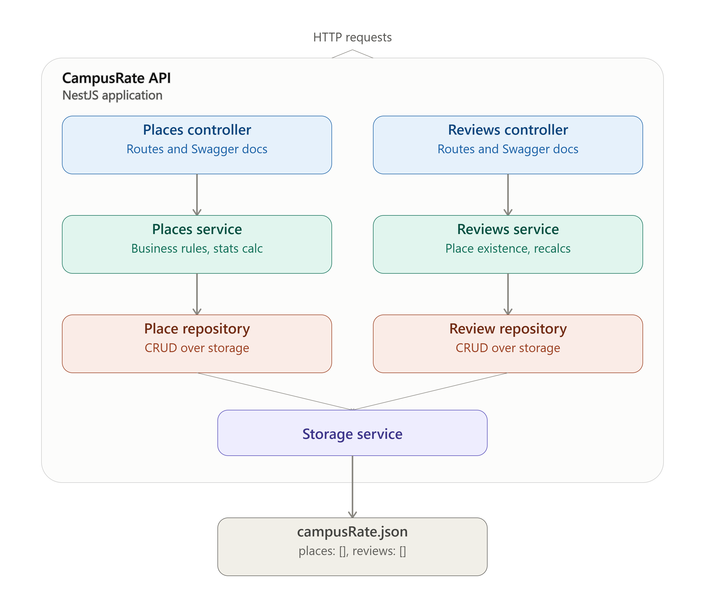

# CampusRate

CampusRate is a REST API for browsing and rating places on a college campus. Students can consult study spaces, libraries, food services, and other campus locations, and leave reviews with a rating and a comment. Each place's average rating and review count are calculated automatically from its reviews.

This project was built as part of the 420-514 course (Collecte et interprétation de données) to design, implement, and document a complete HTTP contract following REST conventions, with strict validation, uniform error handling, and file-based persistence.

## Features

- Full CRUD for **places** (study spaces, libraries, food services, etc.)
- Publishing, listing, and managing **reviews** tied to a place
- Filtering places by category, combined with pagination
- Automatic recalculation of a place's average rating and review count whenever a review is created, updated, or deleted
- Conflict protection: a place cannot be deleted while it still has reviews
- Strict input validation with detailed, uniform error responses (RFC 7807 Problem Details)
- Fully documented OpenAPI/Swagger contract
- File-based persistence (JSON) that survives application restarts


## Architecture



The application follows a layered architecture: controllers handle HTTP routing and Swagger documentation, services contain business logic, repositories handle CRUD operations, and a shared `StorageService` manages all reads/writes to a single JSON file.
## Technologies

- [NestJS](https://nestjs.com/) — TypeScript-first Node.js framework
- [TypeScript](https://www.typescriptlang.org/)
- [class-validator](https://github.com/typestack/class-validator) / [class-transformer](https://github.com/typestack/class-transformer) — DTO validation and serialization
- [Joi](https://joi.dev/) — startup configuration validation
- [@nestjs/swagger](https://docs.nestjs.com/openapi/introduction) — OpenAPI documentation
- `node:fs/promises` — asynchronous file-based persistence (no database/ORM)

## Installation

```bash
git clone https://github.com/WilliamGirouard/CampusRate.git
cd campus-rate
npm ci
```

## Configuration

Copy the example environment file and adjust as needed:

```bash
cp .env.example .env
```

| Variable | Required | Default | Description |
|---|---|---|---|
| `PORT` | No | `3000` | Port the application listens on |
| `DATA_FILE_PATH` | **Yes** | — | Path to the JSON file used for persistence |

Configuration is validated at startup with a Joi schema. If `DATA_FILE_PATH` is missing or `PORT` is invalid, the application refuses to start and prints a clear error message.

## Running the Application

```bash
# Development (with hot reload)
npm run start:dev

# Production
npm run start
```

On first launch, if the data file does not exist yet, it is created automatically at the configured path with the shape `{ "places": [], "reviews": [] }`.

## Linting and Build

```bash
npm run lint
npm run build
```

Both must complete without errors before submission.

## API Documentation (Swagger)

Once the application is running, the interactive API documentation is available at:

```
http://localhost:3000/docs
```

The raw OpenAPI JSON document is available at:

```
http://localhost:3000/docs/openapi.json
```

A static copy of the generated OpenAPI specification is also included in this repository at [`docs/openapi.json`](./docs/openapi.json).

## Manual Testing

A Postman collection covering the required test scenarios (creation, consultation, modification, deletion, validation errors, not-found, conflict, filtering, pagination, and persistence across a restart) is available at [`postman/CampusRatePostman.json`](./postman/CampusRatePostman.json).

## API Contract Overview

All routes are prefixed with `/api/v1`.

| Capability | Method | URI | Success | Notes |
|---|---|---|---|---|
| Create a place | `POST` | `/places` | `201` | Returns `Location` header |
| List places (filter + paginate) | `GET` | `/places?category=&page=&limit=` | `200` | Returns `{ data, pagination }` |
| Get a place | `GET` | `/places/{id}` | `200` | |
| Update a place | `PATCH` | `/places/{id}` | `200` | Partial update |
| Delete a place | `DELETE` | `/places/{id}` | `204` | `409` if the place has reviews |
| Create a review for a place | `POST` | `/places/{placeId}/reviews` | `201` | Returns `Location` header; recalculates the place's stats |
| List reviews for a place | `GET` | `/places/{placeId}/reviews` | `200` | |
| Get a review | `GET` | `/reviews/{id}` | `200` | |
| Update a review | `PATCH` | `/reviews/{id}` | `200` | Recalculates the place's stats |
| Delete a review | `DELETE` | `/reviews/{id}` | `204` | Recalculates the place's stats |

### Design Decisions

| Decision | Choice | Justification |
|---|---|---|
| Resource naming | `places`, `reviews` | English, plural, lowercase, no action verbs, per REST conventions |
| Versioning | URI-based (`/api/v1/...`) | Explicit and visible in every request; simplifies routing and cache behavior compared to header-based versioning |
| Nesting | Mixed: nested for creation/listing, independent for single-resource operations | `POST/GET /places/{placeId}/reviews` expresses the real ownership relationship (a review always belongs to a place); `GET/PATCH/DELETE /reviews/{id}` stays independent once the review's own id is known, keeping URIs shorter and stable |
| Path parameters | `id` for the current resource, `placeId` when referencing a place from a nested route | Avoids ambiguity between "this resource" and "the parent resource" |
| Success codes | `200` (read/update), `201` (create, with `Location`), `204` (delete, no body) | Matches HTTP semantics exactly |
| Error codes | `400` invalid input, `404` missing resource, `409` conflict, `500` unexpected error | One code per distinct failure category, as required |

## Business Rules

- A review always references an existing place; creating a review for a non-existent place returns `404`.
- `id`, `placeId`, timestamps, and calculated fields (`averageRating`, `reviewCount`) can never be set by the client — they are server-generated and rejected if present in a request body.
- A place with no reviews exposes `averageRating: null` and `reviewCount: 0`.
- Creating, updating, or deleting a review recalculates the related place's `averageRating` and `reviewCount`.
- Deleting a place that still has reviews is refused with `409 Conflict`.
- `category` and `status` are restricted to fixed, documented enum values.

## Filtering and Pagination

`GET /places` accepts:

| Parameter | Type | Default | Max | Description |
|---|---|---|---|---|
| `category` | enum string | — | — | Exact match filter |
| `page` | integer | `1` | — | Page requested |
| `limit` | integer | `10` | `25` | Items per page |

Filtering and pagination can be combined. An empty result set returns `200` with `data: []`, never an error.

## Error Format

All errors follow [RFC 7807 Problem Details](https://datatracker.ietf.org/doc/html/rfc7807) and are returned with the `application/problem+json` content type:

```json
{
  "type": "https://campus-rate.example/problems/not-found",
  "title": "Not Found",
  "status": 404,
  "detail": "Couldn't find place with id plc_doesnotexist",
  "instance": "/api/v1/places/plc_doesnotexist"
}
```

Validation errors additionally include an `errors` array listing every failed constraint. Unexpected internal errors (e.g. a corrupted data file) always return a generic, safe message — no stack trace, internal file path, or raw file content is ever exposed to the client.

## Persistence

Data is stored in a single JSON file, structured as:

```json
{
  "places": [],
  "reviews": []
}
```

The file path is configurable via `DATA_FILE_PATH` and validated at startup. All reads and writes use the asynchronous `node:fs/promises` API.

Persistence logic is fully isolated from business logic:

- **`StorageService`** (in `src/storage`) is the single source of truth for raw file I/O: it initializes the file if missing, reads and parses it, and writes it back. It has no knowledge of `Place` or `Review` as business concepts.
- **`PlaceRepository`** and **`ReviewRepository`** sit on top of `StorageService` and expose resource-specific operations (`findAll`, `findById`, `create`, `update`, `delete`) to their respective services.
- Services (`PlacesService`, `ReviewsService`) contain all business rules (validation of relationships, conflict checks, statistics recalculation) and never touch the filesystem directly.

If the JSON file is corrupted (invalid syntax), `StorageService` catches the parsing error and throws a controlled `500` exception instead of crashing the application or leaking the malformed content.

## Known Limitations

- **No concurrency control**: each write reads and rewrites the entire JSON file. Concurrent requests writing at the same time could overwrite each other's changes (a "last write wins" scenario). This is acceptable for the scope of this project but would need file locking or a real database in production.
- **ID generation**: identifiers are generated with `Math.random()` rather than a cryptographically secure source. Collision probability is negligible at this project's scale, but this would not be suitable for a production system with high write volume.
- **No authentication or authorization**: all endpoints are publicly accessible. Access control was out of scope for this assignment.
- **Single-file storage**: as the dataset grows, reading and rewriting the entire file on every write becomes increasingly inefficient. This trade-off was accepted in favor of the simplicity required by the assignment's persistence constraints.

## License

This project was built for academic purposes as part of the 420-514 course.
